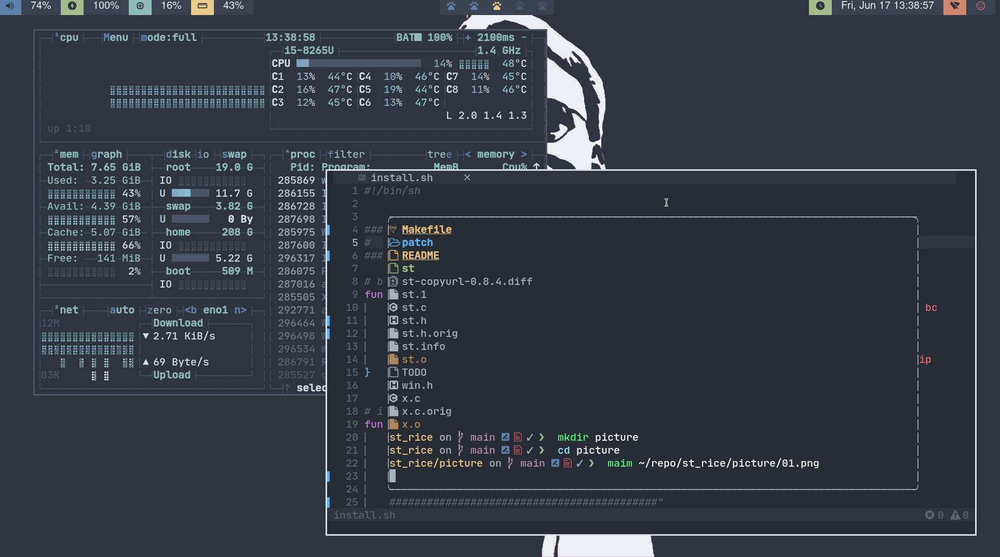

# st - simple terminal
*st is a simple terminal emulator for X which sucks less*


## Requirements
- In order to build st you need the Xlib header files.


## scree shot


## Installation
```sh
    sudo make install
```


## patch
- st-alpha-0.8.2
- st-nordtheme-0.8.2


## special thanks
- [Youtube-The Simple Terminal: st from Suckless, and how I extend it](https://www.youtube.com/watch?v=uqLcvKYl-Ms)


## reference
- [suckless.org](https://st.suckless.org/)
- [My arch linux set](https://github.com/opottghjk00/archSetup)
- [My dot files](https://github.com/opottghjk00/dotx)
- [My terminal text editor set up](https://github.com/opottghjk00/nvimIDE)
